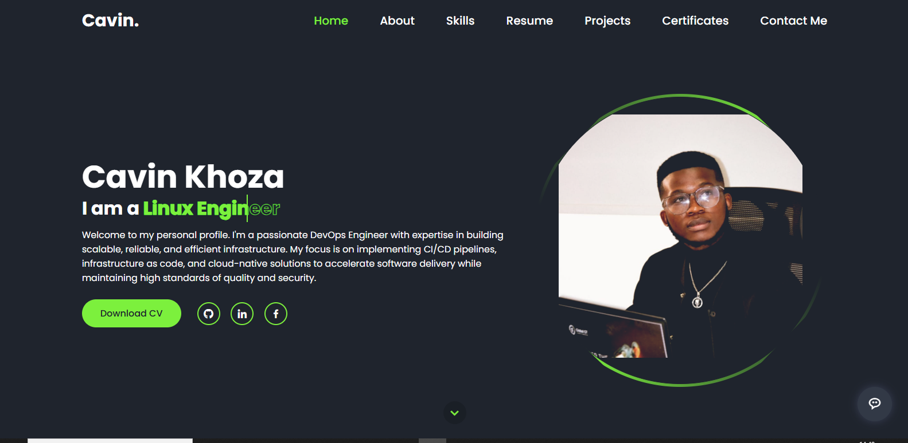

#  DevOps Engineer Portfolio


## 📌 Table of Contents
- [Features](#-features)
- [Tech Stack](#-tech-stack)
- [Project Structure](#-project-structure)
- [Installation](#-installation)

## ✨ Features

### 🎨 UI Components
- **Responsive Navigation Bar**
- **Animated Skill Progress Bars**
- **Interactive Project Cards**
- **Timeline-style Resume Section**
- **Toggleable AI Chatbot**

### ⚙️ Functionality
- **Smooth Scroll Navigation**
- **Form Validation & Submission**
- **Dynamic Content Loading**
- **Mobile-Friendly Design**
- **Accessibility Optimized**

## 💻 Tech Stack

### Core Technologies
| Technology | Purpose |
|------------|---------|
|  | Page Structure |
|  | Styling |
|  | Interactivity |

### Integrations
| Service | Usage |
|---------|-------|
|  | Icons |
|  | AI Chatbot |
|  | Contact Form |

## 📂 Project Structure
```plaintext
portfolio/
│
├── index.html          # Main application file
├── LICENSE             # MIT License
├── README.md           # This documentation
├── scripts.js          # All JavaScript functionality
├── styles.css          # Main stylesheet
│
├── .vscode/            # VS Code configuration
│   └── launch.json     # Debug settings
│
└── assets/
    ├── CAVIN_CV.pdf    # Downloadable resume PDF
    │
    └── images/         # All image assets
        ├── bank.png
        ├── Capture.PNG
        ├── chatbot-icon-concept.avif
        ├── eskom.png
        ├── health.jpg
        ├── Image.jpeg
        ├── leave.jpeg
        ├── me.jpg
        ├── mine monitor.jpeg
        ├── portfolio.png
        └── SUPPLY.PNG
```

## 🛠️ Installation

1. Clone the repository:
```bash
git clone https://github.com/calvinkhoza/portfolio.git
cd portfolio
```
<div align="center"> <p>Connect with me:</p> <p> <a href="https://github.com/calvinkhoza" target="_blank">  </a> <a href="https://linkedin.com/in/yourprofile" target="_blank">  </a> </p> </div> 
